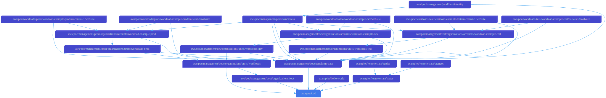

# Terragrunt Configuration for Amazon Web Services

> Proof-of-concept Terragrunt configuration repository for Amazon Web Services

This project uses a single [parent `terragrunt.hcl` file](terragrunt.hcl) that
is included by all child `terragrunt.hcl` files. The parent `terragrunt.hcl`
file provides `terragrunt`, and `remote_state` blocks as well as an `inputs`
attribute that can be configured via `terragrunt.yml` files that are located
in each level of the configuration directory hierarchy.

For more details on this approach, and the definition of supported attributes
in `terragrunt.yml` files, see the [documentation](docs/terragrunt/README.md).

## Features

### GitHub actions

- [**Remote Merge**](.github/actions/remote-merge): Merges the history of a
  branch or tag in another repository into this repository.

### GitHub workflows

- [**Integration**](.github/workflows/integration.yml): Validates all commit
  messages using `commitlint`.
- [**Release**](.github/workflows/release.yml): Maintains a changelog, release
  tags, and releases on GitHub.
- [**Downstream**](.github/workflows/downstream.yml): Notifies repositories
  created from this template of new releases.
- [**Upstream**](.github/workflows/upstream.yml): Keeps this repository
  synchronized with the template that it was created from.

## Directory index

- [aws](aws): Contains `terragrunt.yml` files and Terragrunt configurations (child `terragrunt.hcl` files) for Amazon Web Services
- [modules](modules): Contains all Terraform root modules used by Terragrunt configurations in this repository, and required child modules
- [docs](docs): Reference documentation for this Terragrunt AWS Proof-of-Concept project

## Configuration structure

## Changelog

All relevant changes to this project are documented in the file
[CHANGELOG.md](CHANGELOG.md).

## Contributing

See the file [CONTRIBUTING.md](CONTRIBUTING.md) for contribution guidelines.

## License

[MIT License](LICENSE)
