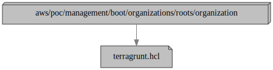

# Organization

This configuration uses
the [aws-management-organizations-root](../../../../../../../modules/poc/aws-management-organizations-root)
module to create the [AWS Organizations](https://aws.amazon.com/organizations/)
organization itself, and any policies attached at the root level.

The individual policy documents are located in the [`policies`
subdirectory](policies) and are passed explicitly to the root module via the
[child `terragrunt.hcl`](terragrunt.hcl) file in this directory.

The only policy attached right now is one which [restricts the set of allowed
AWS regions](policies/allow-only-approved-regions.yml). With a few exceptions
for global services, any access to other regions will be denied across the
entire organization.

Note
that [service control policies (SCPs)](https://docs.aws.amazon.com/organizations/latest/userguide/orgs_manage_policies_scps.html)
only affect *member* accounts in the organization. They have no effect on users
or roles in the management account.

## Dependencies

