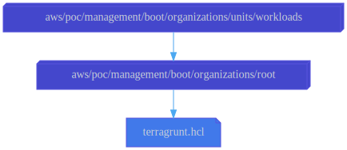

# Workloads OU

This configuration uses the
[aws-management-organizations-unit](../../../../../../../modules/poc/aws-management-organizations-unit)
root module to create the top-level
[organizational unit (OU)](https://docs.aws.amazon.com/organizations/latest/userguide/orgs_manage_ous.html)
named "Workloads."

No service control policies are attached to this OU, yet.The Workloads OU
merely serves as a container for other organizational units which contain
organization member accounts for workloads. Child OUs of the Workloads OU should
be named after software development stages, as recommended by AWS.in the article
[Establishing your best practice AWS environment](https://aws.amazon.com/organizations/getting-started/best-practices/?orgs_product_gs_bp).

## Dependencies

This configuration depends on the [Organization](../../roots/organization)
configuration to specify the parent under which the OU should be created.

