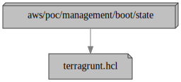

# State

This configuration uses the
[aws-management-state](../../../../../modules/poc/aws-management-state)
root module to create the
[Terraform remote state](https://www.terraform.io/docs/language/state/remote.html)
S3 buckets, DynamoDB tables and IAM policies required by each tier and
development stage, other than the "boot" stage in the "management" tier, which
relies on a remote state created by Terragrunt.

## Why do we not use Terragrunt to create remote state storage?

We don't want to rely on Terragrunt to create the remote state storage resources
for the other tiers and stages, because we normally don't want to allow any IAM
users to create new resources in the management account, such as the storage for
Terraform remote states.

Additionally, creating the remote state storage resources via Terraform itself
gives us more control over how they are created. For example, we could use
customer-managed KMS keys, or randomly generated names for S3 buckets.

## Dependencies

