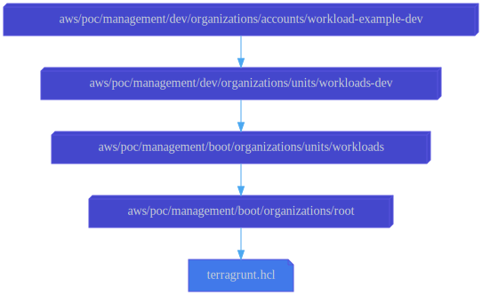

# Workload-Example-Dev Account

This configuration uses the
[aws-management-organizations-account](../../../../../../../modules/poc/aws-management-organizations-account)
root module to create an organization member account.

## Roles

The member account will be used to host a static website in an S3 bucket.
Therefore, this configuration creates an IAM role named
[WebsiteAdministratorRole](roles/website-administrator.yml)
which grants only the permission to manage S3 buckets. Every developer
should be allowed to assume this role.

## Dependencies

This configuration depends on the [Workloads/Dev OU](../../units/workloads-dev)
configuration to specify the parent OU for this member account.

