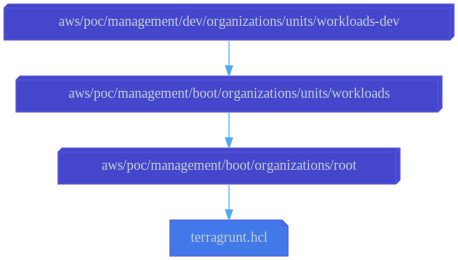

# Workloads/Dev OU

This configuration uses the
[aws-management-organizations-unit](../../../../../../../modules/poc/aws-management-organizations-unit)
root module to create the
[organizational unit (OU)](https://docs.aws.amazon.com/organizations/latest/userguide/orgs_manage_ous.html)
named "Dev."

No service control policies are attached to this OU, yet. This OU merely serves
as a container for organization member accounts hosting workloads in the
development ("dev") stage.

## Dependencies

This configuration depends on the
[Workloads OU](../../../../boot/organizations/units/workloads)
configuration to specify the parent for this organizational unit.

