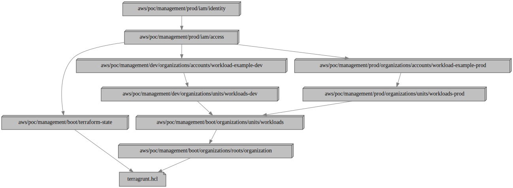

# IAM Identity

This configuration uses the
[aws-management-iam-identity](../../../../../../modules/poc/aws-management-iam-identity)
root module to create IAM users in the management account.

The IAM users to create, their group memberships, and managed access keys
(mostly for non-human service accounts) are defined in the
[`users.yml`](users.yml) file.

The actual permissions granted to IAM users for resources in organization member
accounts, and in the management account itself is controlled via membership in
one or more groups defined in the [IAM Access](../access) configuration.

## Dependencies

This configuration depends on the [IAM Access](../access) configuration to
provide the names of IAM groups that the IAM users defined in this configuration
can be made members of.

