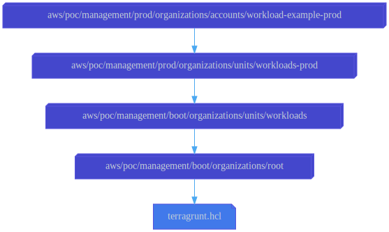

# workload-example-prod

This configuration uses the
[aws-management-organizations-account](../../../../../../../modules/poc/aws-management-organizations-account)
root module to create the organization member account named
"workload-example-prod."

This member account is expected to host a static website in an S3 bucket.
Therefore, this configuration creates an IAM role named
[WebsiteAdministratorRole](roles/website-administrator.yml)
which grants only the permission to manage S3 buckets.

## Dependencies

This configuration depends on the [Workloads/Prod OU](../../units/workloads-prod)
configuration to specify the parent OU for this member account.

