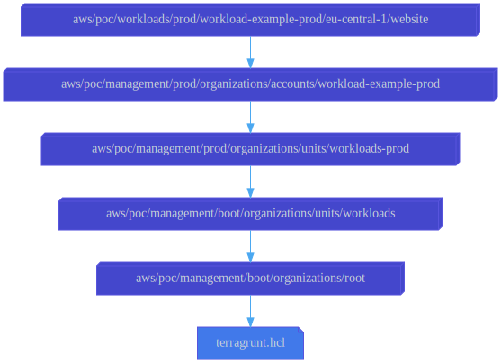

# Website

This configuration uses the
[aws-workloads-website](../../../../../../../modules/poc/aws-workloads-website)
root module to create a static example website hosted in an S3 bucket in the
**eu-central-1** region.

## Dependencies

This configuration depends on the
[workload-example-prod](../../../../../management/prod/organizations/accounts/workload-example-prod)
configuration to specify the AWS account in which the website is to be deployed.

