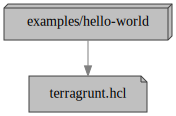

# hello-world

## Dependencies

<!--- BEGIN_TF_DOCS --->
## Requirements

| Name | Version |
|------|---------|
| terraform | >= 1.0 |

## Providers

No provider.

## Modules

No Modules.

## Resources

No resources.

## Inputs

| Name | Description | Type | Default | Required |
|------|-------------|------|---------|:--------:|
| example | The name of the first subdirectory under the "examples" directory in this repository. | `string` | n/a | yes |
| hello | An example input variable defined in the `inputs` attribute of a terragrunt.yml file. | `string` | n/a | yes |
| root | The name of the first subdirectory under to the root directory, leading to the current Terragrunt configuration directory. | `string` | n/a | yes |

## Outputs

| Name | Description |
|------|-------------|
| example | Same value as the `example` input variable. |
| hello | Same value as the `hello` input variable. |
| root | Same value as the `root` input variable. |

<!--- END_TF_DOCS --->
